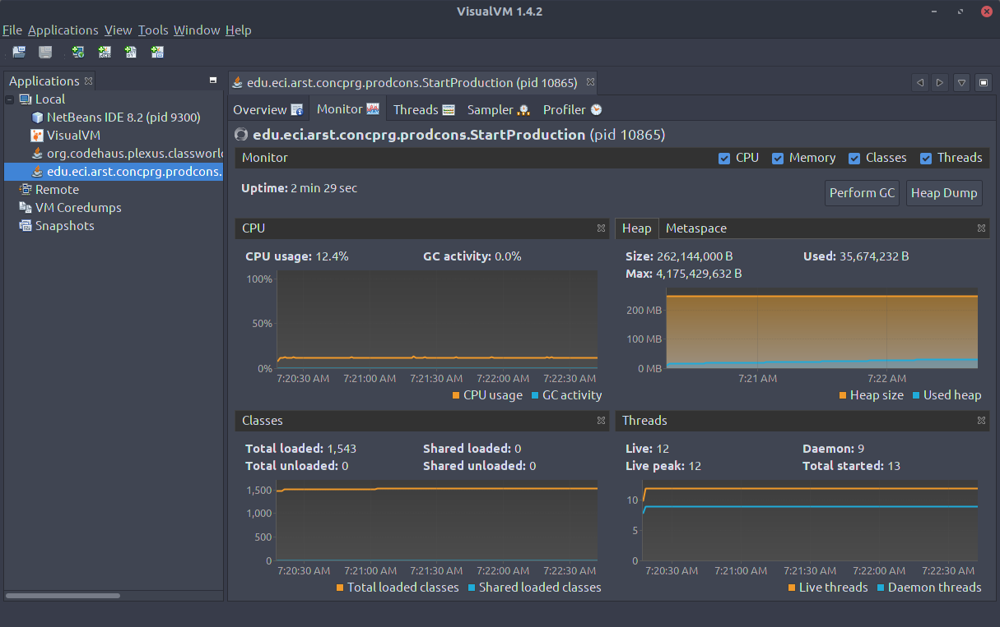
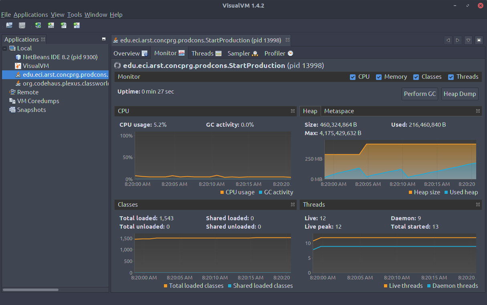
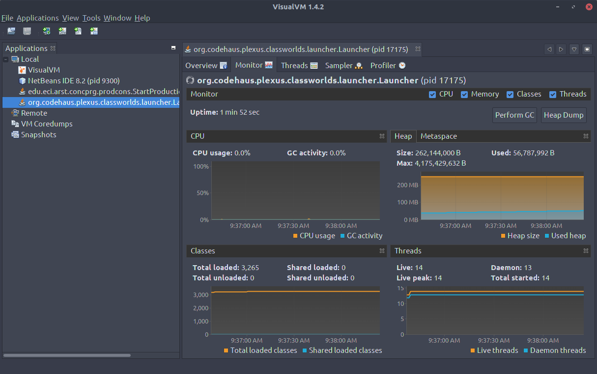

# Workshop4

## Part I
1. 
> What is the reason of this CPU consumption?  
> **Answer:** the reason is because there is an active wait in the producer.  

 

> What is the class responsible of that consumption?  
> **Answer:** The class responsible for the CPU consume is Producer.

2. 

3. 

## Part II
